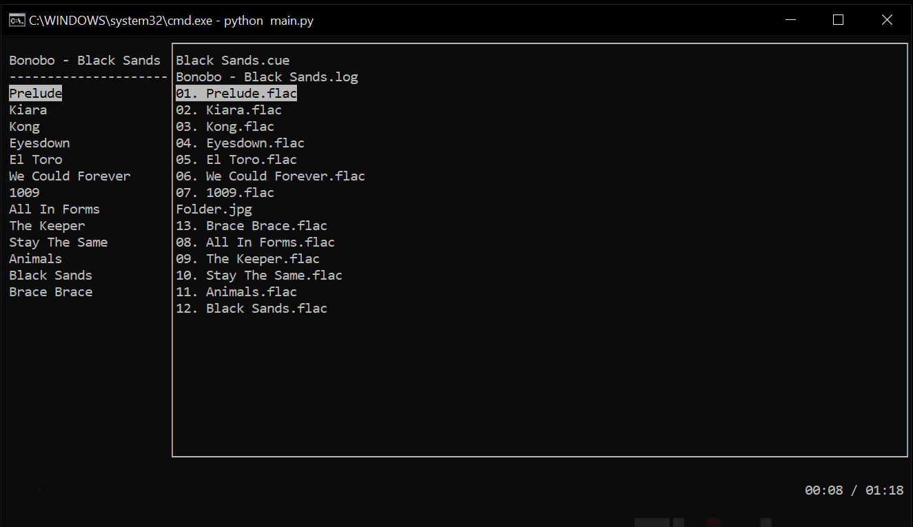

# constellation
_Minimalistic, lightweight MP3, WAVE and FLAC music player._



---

This project is a TUI front end for this [playsound](https://github.com/Zehina/playsound) fork.It is in beta stages but you can try by installing the dependency, cloning the project and running the `main.py` python script.

FLAC files are converted to WAVE files via [simpleaudio](https://github.com/hamiltron/py-simple-audio) then playback is handled by playsound.

## features
* minimal, terminal-based design
* supports FLAC, WAVE and MP3 files
* file browser to navigate given directory
* hotkeys to pause/play, stop, skip/prev song, etc.
* currently only takes, at most, \~30MB of memory
* playlist support

## dependencies
-[windows-curses](https://github.com/zephyrproject-rtos/windows-curses)-
-[soundfile](https://github.com/bastibe/SoundFile)-
-[tinytag](https://github.com/devsnd/tinytag)-
-[keyboard](https://github.com/boppreh/keyboard)-
-[numpy](https://github.com/numpy/numpy)-

After cloning this repo, you can use this install these dependencies with the requires.txt file

```
~path\to\clone\directory> pip -r requires.txt
```

## compiling instructions

You can run [main.py](https://github.com/acemasterjb/constellation/blob/master/constellation/main.py) from a terminal, though if you rather compile this project you can simply use pyinstaller.

```
~\> pip install pyinstaller
~\> pyinstaller -D constellation main.py
```
You will also need to copy the contents of the libs folder into the pyinstaller-generated one in order to use the `quark.py` and `lumen.py` dependencies.

## tutorial

Once you run `main.py` or the constellations.exe compilled from the above instructions, you will be prompted to choose your music through the file browser.

Choose you music folder with the `Enter` key. Go up a level with `q`.


## hotkeys
* Press `Enter` to play a song or enter a directory/folder
* `q` go up a directory
* `p` to pause and resume playback 
* `ctrl + s` to stop playback
* `ctrl + q` to stop a song (if in queue) and exit the program
* `ctrl + >` to skip song
* `ctrl + <` to go to previous song

> Note: all hotkeys can only be used while in window for now


## current state
This project is a WIP. [The features list](#features) will be updated when each of these are crossed out.

~~Currently working on how to properly pause and resume.~~

~~Currently working on how to navigate while playing music~~

~~Currently working on segmenting tui window into widgets~~

~~Packaging for executable~~ (instructions given)

~~Currently working on seeking.~~

~~Currently working on playlist/queuing~~

Omni-directory: user chooses parent directory and Const shows a single view of all songs in directory tree

Currently working on Gapless Playback

# Mission
- To create a lightweight music play that can be ran in the terminal/cmd window
- To provide support for a variety of containers
- To provide a seamless TUI music player experience
- To provice cross-platform support
- **To make a simple music player that anyone can use**